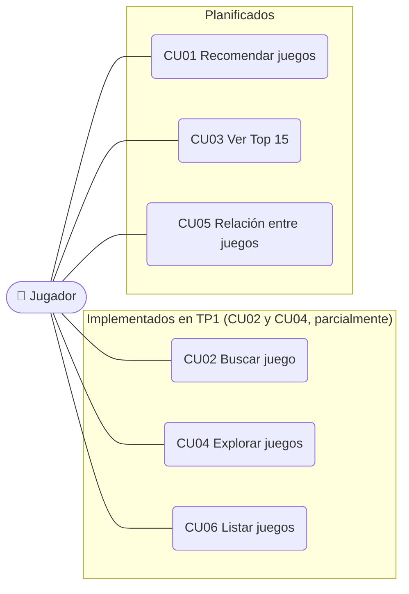

# Casos de uso — Pixperience

## Diagrama

## CU01 — Recomendar juegos (RF01)
- **Actor:** Jugador
- **Precondición:** el catálogo está cargado.
- **Flujo principal:**
  1. El jugador selecciona "Recomendar juegos".
  2. El sistema pide un juego que le guste.
  3. El jugador ingresa un título.
  4. El sistema pide otro juego, o dejar la respuesta vacía para continuar.
  5. Se repiten los pasos 3 y 4 hasta que el jugador deja la respuesta vacía.
  6. El sistema muestra los juegos recomendados.
- **Flujo alternativo:** si un título no existe en el catálogo, el sistema lo informa y vuelve a pedirlo.
- **Ejemplo:** entrada *Kingdom Come Deliverance 2* → *Mount & Blade Warband, Mount & Blade 2 Bannerlord, For Honor, Dark Souls*.

## CU02 — Buscar juego (RF02)
- **Actor:** Jugador
- **Precondición:** el catálogo está cargado.
- **Flujo principal:**
  1. El jugador selecciona "Buscar juego".
  2. El sistema pregunta qué juego desea buscar.
  3. El jugador ingresa el título.
  4. El sistema muestra la ficha del juego: título, género, tags, desarrollador, rating y horas jugadas.
- **Flujo alternativo:** si no existe, el sistema informa que no se encontró el título.
- **Estado TP1/TP2:** la ficha muestra título, género y rating. La búsqueda en producción
  es secuencial (`algoritmos/busqueda_secuencial.py`). TP2 comparó esta estrategia contra
  un árbol balanceado a nivel experimental (ver `docs/tp2-complejidad.md`); la integración
  de una estructura más eficiente a este caso de uso queda para TP3.

## CU03 — Ver Top 15 (RF03)
- **Actor:** Jugador
- **Precondición:** el catálogo está cargado.
- **Flujo principal:**
  1. El jugador selecciona "Top 15 juegos".
  2. El sistema pregunta qué criterio le interesa (rating, popularidad, etc.).
  3. El jugador elige el criterio.
  4. El sistema muestra los 15 primeros, ordenados de mayor a menor.
- **Flujo alternativo:** si el criterio no es válido, el sistema lo informa y vuelve a preguntar.

## CU04 — Explorar juegos (RF04)
- **Actor:** Jugador
- **Precondición:** el catálogo está cargado.
- **Flujo principal:**
  1. El jugador selecciona "Explorar juegos".
  2. El sistema pregunta qué géneros o tags le interesan.
  3. El jugador ingresa uno o varios.
  4. El sistema muestra los juegos que coinciden.
- **Flujo alternativo:** si no hay coincidencias, el sistema lo informa.
- **Estado TP1:** filtra por un único género.

## CU05 — Relación entre juegos (RF05)
- **Actor:** Jugador
- **Precondición:** el catálogo está cargado.
- **Flujo principal:**
  1. El jugador selecciona "Relación entre juegos".
  2. El sistema pide una lista de juegos a comparar.
  3. El jugador ingresa la lista.
  4. El sistema muestra las relaciones encontradas entre pares, indicando el motivo
     (género, clasificación, tag en común).
- **Flujo alternativo:** si un par no tiene relación, el sistema lo indica; si un título no existe, lo informa.

## CU06 — Listar juegos (RF07)
- **Actor:** Jugador
- **Precondición:** el catálogo está cargado.
- **Flujo principal:**
  1. El jugador selecciona "Listar todos los videojuegos".
  2. El sistema muestra cada juego en una línea (título, género, rating).
