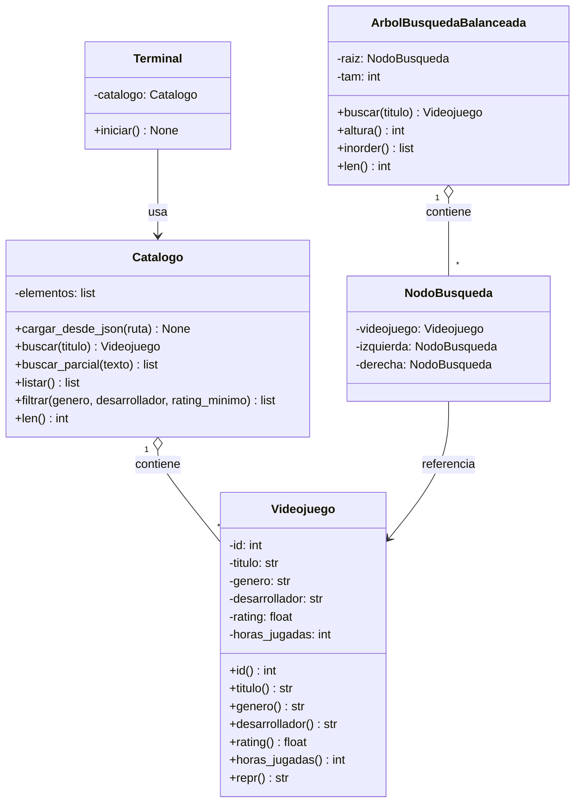

# Diagrama de clases

> Actualizado en TP2 con las clases de la estrategia de árbol.

> **Nota:** `Catalogo.buscar()` delega en la función `buscar_secuencial()` de
> `algoritmos/busqueda_secuencial.py` (no aparece en el diagrama por ser una función
> suelta, no una clase). `ArbolBusquedaBalanceada` **no está conectada** a `Catalogo` ni
> a `Terminal`: es una estructura exclusiva del experimento de TP2
> (`experimentos/benchmark_tp2.py`), no integrada todavía a la aplicación.

## Diferencias respecto del diagrama inicial (TP0)

- La clase de dominio se llama `Videojuego` (en TP0 figuraba como `Juego`).
- `Videojuego` todavía no tiene el atributo `tags`; se incorpora cuando se lo necesite
  (RF04 y RF05), probablemente en TP5.
- Las estructuras (`ArbolAVL`, `ArbolGeneral`, `Heap`, `Grafo`) y el `Recomendador`
  del diagrama de TP0 se agregan en las etapas TP3 a TP8. Ver `04-diagrama-datos.md`.
- Se agregaron `Catalogo` y `Terminal`, que en TP0 no estaban diagramadas.
- TP2 agregó `ArbolBusquedaBalanceada` y `NodoBusqueda`, exclusivas del experimento de
  comparación de estrategias de búsqueda; no reemplazan al BST que se construye en TP3.
