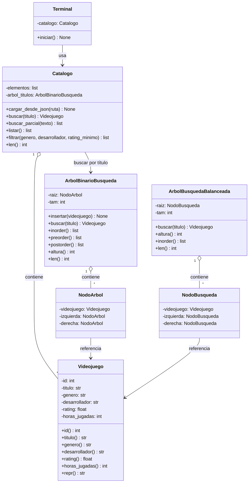

# Diagrama de clases

> Actualizado en TP3: muestra tanto el árbol estático experimental de TP2 como el BST
> dinámico que ahora usa la aplicación.

```mermaid
classDiagram
    class Videojuego {
        -id: int
        -titulo: str
        -genero: str
        -desarrollador: str
        -rating: float
        -horas_jugadas: int
        +id() int
        +titulo() str
        +genero() str
        +desarrollador() str
        +rating() float
        +horas_jugadas() int
        +repr() str
    }

    class Catalogo {
        -elementos: list
        -arbol_titulos: ArbolBinarioBusqueda
        +cargar_desde_json(ruta) None
        +buscar(titulo) Videojuego
        +buscar_parcial(texto) list
        +listar() list
        +filtrar(genero, desarrollador, rating_minimo) list
        +len() int
    }

    class Terminal {
        -catalogo: Catalogo
        +iniciar() None
    }

    class ArbolBinarioBusqueda {
        -raiz: NodoArbol
        -tam: int
        +insertar(videojuego) None
        +buscar(titulo) Videojuego
        +inorder() list
        +preorder() list
        +postorder() list
        +altura() int
        +len() int
    }

    class NodoArbol {
        -videojuego: Videojuego
        -izquierda: NodoArbol
        -derecha: NodoArbol
    }

    class ArbolBusquedaBalanceada {
        -raiz: NodoBusqueda
        -tam: int
        +buscar(titulo) Videojuego
        +altura() int
        +inorder() list
        +len() int
    }

    class NodoBusqueda {
        -videojuego: Videojuego
        -izquierda: NodoBusqueda
        -derecha: NodoBusqueda
    }

    Terminal --> Catalogo : usa
    Catalogo "1" o-- "*" Videojuego : contiene
    Catalogo --> ArbolBinarioBusqueda : buscar por título
    ArbolBinarioBusqueda "1" o-- "*" NodoArbol : contiene
    NodoArbol --> Videojuego : referencia
    ArbolBusquedaBalanceada "1" o-- "*" NodoBusqueda : contiene
    NodoBusqueda --> Videojuego : referencia
```

> **Nota:** `Catalogo.buscar()` delega en `ArbolBinarioBusqueda.buscar()`. La búsqueda
> secuencial (`algoritmos/busqueda_secuencial.py`) se conserva para la comparación. El
> `ArbolBusquedaBalanceada` sigue aislado en el experimento TP2 y no se reutiliza: la
> nueva estructura se construye insertando cada juego en el orden de carga.

## Diferencias respecto del diagrama inicial (TP0)

- La clase de dominio se llama `Videojuego` (en TP0 figuraba como `Juego`).
- `Videojuego` todavía no tiene el atributo `tags`; se incorpora cuando se lo necesite
  (RF04 y RF05), probablemente en TP5.
- Las estructuras (`ArbolAVL`, `ArbolGeneral`, `Heap`, `Grafo`) y el `Recomendador`
  del diagrama de TP0 se agregan en las etapas TP4 a TP8. Ver `04-diagrama-datos.md`.
- Se agregaron `Catalogo` y `Terminal`, que en TP0 no estaban diagramadas.
- TP2 agregó `ArbolBusquedaBalanceada` y `NodoBusqueda`, exclusivas del experimento de
  comparación de estrategias de búsqueda; no reemplazan al BST que se construye en TP3.
