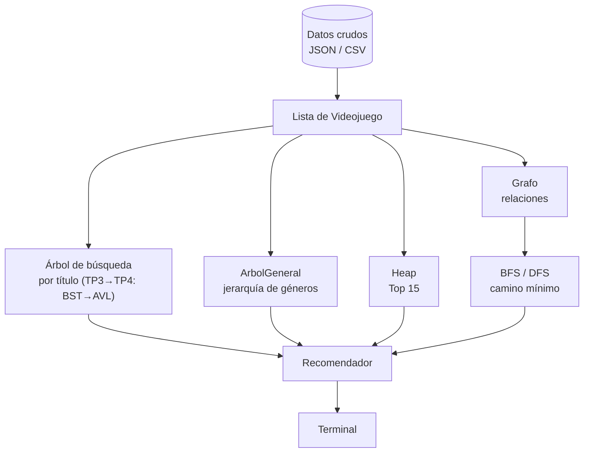

# Diagrama de conexión entre estructuras

## Estado actual (TP2)

Hay dos caminos separados: el de producción (lo que usa la terminal) y el del
experimento de TP2 (lo que mide `benchmark_tp2.py`). Todavía no están unificados —
esa unificación es, justamente, el trabajo de TP3.

```mermaid
flowchart TD
    A[("datos/videojuegos.json<br/>datos crudos")] -->|cargar_desde_json| B["list[Videojuego]<br/>Catalogo._elementos"]

    subgraph prod["Producción (Terminal)"]
        B -->|buscar_secuencial - O(n)| C["Catalogo.buscar()"]
        B -->|recorrido O(n)| D["buscar_parcial / filtrar"]
        B -->|copia de la lista| E["listar"]
    end

    C --> F["Terminal (menú)"]
    D --> F
    E --> F

    subgraph exp["Experimento TP2 (benchmark_tp2.py, no integrado)"]
        B -.->|expandido con sufijos únicos| G["list[Videojuego] sintética<br/>100 / 1.000 / 10.000 / 100.000"]
        G -->|ordenar + partir al medio, O(n log n)| H["ArbolBusquedaBalanceada"]
        H -->|búsqueda - O(log n)| I["resultados_tp2.csv<br/>tp2-complejidad.md"]
        G -->|buscar_secuencial - O(n)| I
    end
```

**Estructuras en producción hoy:** una única lista de objetos `Videojuego`. Toda
consulta la recorre completa (`buscar`, `buscar_parcial`, `filtrar`, `listar`): O(n).

**Estructura del experimento de TP2:** `ArbolBusquedaBalanceada`, construida ordenando
los datos y particionando recursivamente por el elemento medio. Da altura O(log n) por
construcción, pero **no está conectada a `Catalogo` ni a `Terminal`** — vive solo dentro
de `experimentos/benchmark_tp2.py`, y no se puede desbalancear (no se le inserta nada
después de construida), así que no sirve como base para TP3/TP4.

## Diagrama objetivo (producto final)



## Evolución prevista

| Etapa | Estructura | Requerimiento | Por qué esta estructura |
|-------|------------|----------------|---------------------------|
| TP2 | `buscar_secuencial` vs. `ArbolBusquedaBalanceada` (experimental) | RF02 | Medir el costo real de la búsqueda lineal y compararlo contra una estructura logarítmica, antes de comprometerse a integrar una. |
| TP3 | BST por título, **construido por inserción** (no reutiliza el árbol de TP2) | RF02 | Primer paso hacia una búsqueda logarítmica integrada a la app. Necesita poder desbalancearse, para que TP4 tenga algo real que resolver. |
| TP4 | `ArbolAVL<Videojuego>` | RF02 | Búsqueda por título en tiempo logarítmico garantizado; el balance automático evita que degenere en lista si el dataset viene ordenado alfabéticamente. |
| TP5 | `ArbolGeneral<Videojuego>` | RF04 | Navegar una jerarquía de géneros y subgéneros, algo que un árbol binario no soporta. |
| TP6 | `Heap<Videojuego>` | RF03 | Extraer repetidamente el juego de mayor puntaje sin ordenar todo el catálogo cada vez. |
| TP7 | `Grafo<Videojuego>` | RF01, RF05 | Juegos como nodos; aristas precalculadas según género, tags y desarrollador compartidos, para no comparar contra todo el catálogo en cada consulta. |
| TP8 | BFS / DFS | RF01, RF05 | Explorar la red de relaciones. |
| TP9 | Camino mínimo | A definir | Se define qué significa "costo" entre dos juegos. |
