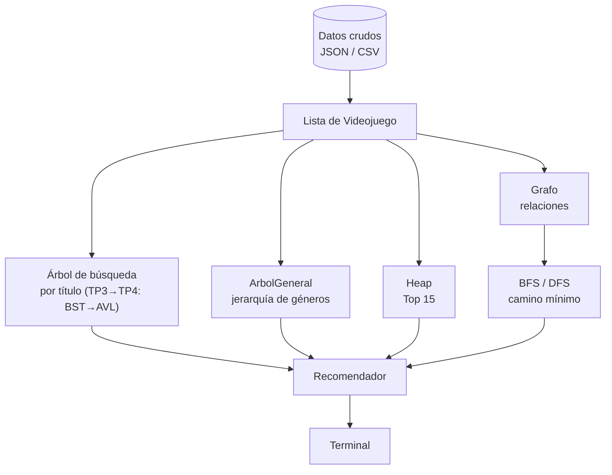

# Diagrama de conexión entre estructuras

## Estado actual (TP3)

La carga conserva una lista para listar y filtrar. Para buscar por título, `Catalogo`
mantiene un BST dinámico construido por inserción en el orden de los datos. El árbol
balanceado estático de TP2 sigue separado como referencia experimental.

```mermaid
flowchart TD
    A[("datos/videojuegos.json<br/>datos crudos")] -->|cargar_desde_json| B["list[Videojuego]<br/>Catalogo._elementos"]

    subgraph prod["Producción (Terminal v2)"]
        B -->|insertar en orden de carga| C["ArbolBinarioBusqueda"]
        C -->|buscar por título - O(h)| D["Catalogo.buscar()"]
        B -->|recorrido O(n)| E["buscar_parcial / filtrar"]
        B -->|copia de la lista| F["listar"]
    end

    D --> G["Terminal<br/>ficha del videojuego"]
    E --> G
    F --> G

    subgraph exp["Comparación experimental"]
        B -.->|sufijos únicos| H["dataset TP3 sintético"]
        H -->|buscar_secuencial - O(n)| I["benchmark_tp3.py"]
        H -->|BST dinámico - O(h)| I
        I --> J["resultados_tp3.csv<br/>tp3-complejidad.md"]
        H -.->|ordenar + partir al medio| K["ArbolBusquedaBalanceada TP2"]
        K -->|O(log n) en ese experimento| L["benchmark_tp2.py"]
    end
```

**Estructuras en producción:** una lista de objetos `Videojuego` y un BST por título.
La búsqueda cuesta O(h): puede promediar O(log n), pero cae a O(n) si el orden de
inserción degenera el árbol. Listar, filtrar y buscar texto parcial conservan sus
recorridos lineales sobre la lista.

**Estructura del experimento de TP2:** `ArbolBusquedaBalanceada`, construido ordenando
los datos y particionando por el elemento medio. Mantiene altura O(log n) por
construcción, pero no está conectado a la aplicación. El BST de producción no la
reutiliza y sí admite una forma degenerada, caso que se abordará con AVL en TP4.

## Diagrama objetivo (producto final)

```mermaid
flowchart TD
    A[("Datos crudos<br/>JSON / CSV")] --> B["Lista de Videojuego"]
    B --> C["Árbol de búsqueda<br/>por título (TP3→TP4: BST→AVL)"]
    B --> D["ArbolGeneral<br/>jerarquía de géneros"]
    B --> E["Heap<br/>Top 15"]
    B --> F["Grafo<br/>relaciones"]
    F --> G["BFS / DFS<br/>camino mínimo"]
    C --> H["Recomendador"]
    D --> H
    E --> H
    G --> H
    H --> I["Terminal"]
```

## Evolución prevista

| Etapa | Estructura | Requerimiento | Por qué esta estructura |
|-------|------------|----------------|---------------------------|
| TP2 | `buscar_secuencial` vs. `ArbolBusquedaBalanceada` (experimental) | RF02 | Medir el costo real de la búsqueda lineal y compararlo contra una estructura logarítmica, antes de comprometerse a integrar una. |
| TP3 | BST dinámico por título, construido por inserción | RF02 | Integra la búsqueda al producto y permite observar cómo el orden de inserción afecta la altura y el costo. |
| TP4 | `ArbolAVL<Videojuego>` | RF02 | Búsqueda por título en tiempo logarítmico garantizado; el balance automático evita que degenere en lista si el dataset viene ordenado alfabéticamente. |
| TP5 | `ArbolGeneral<Videojuego>` | RF04 | Navegar una jerarquía de géneros y subgéneros, algo que un árbol binario no soporta. |
| TP6 | `Heap<Videojuego>` | RF03 | Extraer repetidamente el juego de mayor puntaje sin ordenar todo el catálogo cada vez. |
| TP7 | `Grafo<Videojuego>` | RF01, RF05 | Juegos como nodos; aristas precalculadas según género, tags y desarrollador compartidos, para no comparar contra todo el catálogo en cada consulta. |
| TP8 | BFS / DFS | RF01, RF05 | Explorar la red de relaciones. |
| TP9 | Camino mínimo | A definir | Se define qué significa "costo" entre dos juegos. |
